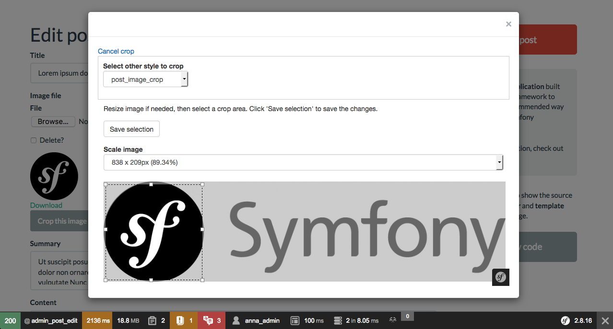

ImageCrop
=========

ImageCrop lets you crop images in Symfony applications, this bundle add a new
form file field extension.

**This bundle don't have an upload utility.**

**Features**

  * Easy use, just add a new parameter to your form class.
  * Allow scaling images
  * Allow crop already uploaded images

**Documentation**

[Resources/doc/](Resources/doc/index.md)
[CHANGELOG](CHANGELOG.md)

-----

License
-------

This bundle is published under the [MIT License](LICENSE)

[Contributions](Resources/doc/contributions.md)
-------
